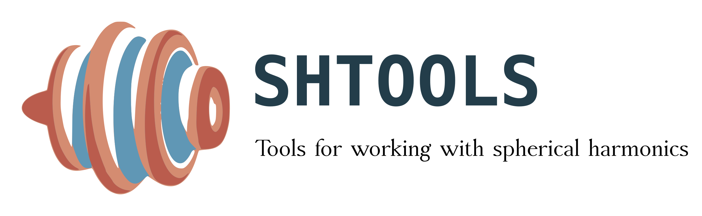

[](https://gitter.im/SHTOOLS/SHTOOLS?utm_source=badge&utm_medium=badge&utm_campaign=pr-badge&utm_content=badge)
[](http://dx.doi.org/10.5281/zenodo.20920)

SHTOOLS is a Fortran 95 / Python library that can be used to perform
spherical harmonic transforms and reconstructions, rotations of data expressed
in spherical harmonics, and multitaper spectral analyses on the sphere.

### FEATURES ###

* A wide range of supported spherical harmonic functions:
   * real and complex,
   * different normalizations (Geodesy" 4&pi, Schmidt semi-normalized, orthonormalized, unnormalized),
   * Condon-Shortley phase factor of (-1)<sup>m</sup>.

* Selected applications and routines:
   * global spectral analysis, spherical harmonic rotations, Wigner3j symbols,
   * localized multitaper spectral analyses, optimal window generation, spherical harmonic coupling matrices,
   * standard gravity and magnetic field calculations, computation of the geoid, finite-amplitude potential from topography.

* Clean implementation of the spherical harmonic transforms:
  * Exact quadrature rules using either the sampling theorem of *Driscoll and Healy* (1994) where data are equally sampled (or spaced) in latitude and longitude, or Gauss-Legendre quadrature.

  * Accurate and fast to approximately degree 2800, corresponding to a spatial
    resolution higher than 4 arc minutes. Transforms and reconstructions take
    on the order of 1 second for bandwidths less than 600 and about 3 minutes
    for bandwidths close to 2800 on standard machines. The Fortran routines are
    OpenMP compatible and OpenMP thread-safe.

### INSTALLATION ###
OSX

```
brew tap shtools/shtools
brew install shtools
```

Linux

```bash
sudo apt-get install libblas-dev liblapack-dev g++ gfortran libfftw3-dev tcsh
```

In the SHTOOLS folder type:
```bash
pip install .
```

In case that you want an editable development installation type:
```bash
pip install -v -e .
```

Manually

```
make
```

To compile the OpenMP version of the fortran routines, use

```
make fortran-mp
```

More installation instructions and options can be found in the 
[wiki](https://github.com/SHTOOLS/SHTOOLS/wiki) and [web documentation](https://shtools.ipgp.fr).


### HOW TO USE ###

SHTOOLS can be invoked from Fortran 95, Python 2, or Python 3. The
base SHTOOLS software is written in Fortran 95, and the Python library allows
simple access to all fortran-compiled routines and offers helper routines as
well as simple interfaces.

To get started, check out the following Python tutorial notebooks:

* [tutorial 1: Simple Spherical Harmonic Expansions](examples/notebooks/tutorial_1.ipynb)
* [tutorial 2: Localized Spectral Analysis on the Sphere](examples/notebooks/tutorial_2.ipynb)
* [tutorial 3: The SHTOOLS Class Interface](examples/notebooks/tutorial_3.ipynb)
* [tutorial 4: Spherical Harmonic Normalizations and Parseval's theorem](examples/notebooks/tutorial_4.ipynb)
* [tutorial 5: Multitaper Spectral Estimation - SHWindows Class Interface](examples/notebooks/tutorial_5.ipynb)


### References
[](http://dx.doi.org/10.5281/zenodo.20920)

### Acknowledgments
SHTOOLS is open source (revised BSD license) and makes use of the freely
available Fourier transform package
[FFTW](http://www.fftw.org) and the linear algebra packages
[LAPACK](http://www.netlib.org/lapack/) and
[BLAS](http://www.netlib.org/blas/).

You can keep up to date by following SHTOOLS on [Twitter](https://twitter.com/SH_tools).
